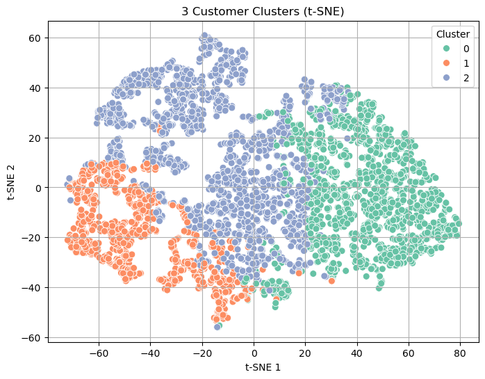
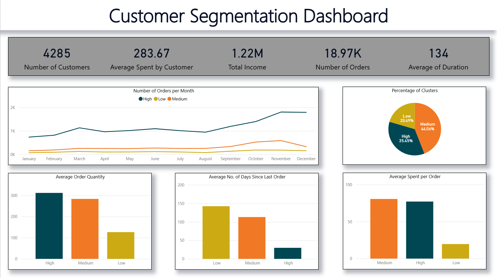

# Online Retail Customer Segmentation

This project segments customers from the Online Retail II dataset (UCI ML Repository, 2009-2010) to identify high-value, medium-value, and low-value customers. The goal is to help businesses target marketing strategies, design loyalty programs, and optimize promotions.

---

## Motivation

Understanding customer behavior is crucial for any retail business. By clustering customers based on purchasing patterns, we can:

- Identify high-value customers for VIP treatment
- Detect medium-value customers for targeted campaigns
- Recognize low-value customers to increase engagement or retention

---

## Dataset

[Online Retail II](https://archive.ics.uci.edu/dataset/502/online+retail+ii) (UCI Machine Learning Repository, 01/12/2009 – 09/12/2010)

Columns:

- `InvoiceNo`: Invoice number (6-digit, starts with 'C' for cancellations)
- `StockCode`: Product code (5-digit integer; sometimes with letters for variants)
- `Description`: Product name
- `Quantity`: Number of items per transaction
- `InvoiceDate`: Date and time of transaction
- `UnitPrice`: Price per unit in £
- `CustomerID`: Customer number
- `Country`: Country name

---

## Data Cleaning & Preprocessing

Key steps:

- Removed rows with null CustomerID
- Excluded cancelled invoices (InvoiceNo starting with 'C')
- Handled stock codes with extra characters (kept as separate items)
- Retained extreme quantities and prices (valid business activity, e.g., wholesale)
- Converted `Country` to categorical
- Split data into:
  - `product_df` → `StockCode` + `Description` (small memory footprint)
  - `order_df` → main transactional data

---

## Feature Engineering

Aggregated data at customer level:

| Feature | Description |
|---------|-------------|
| NumOrders | Number of unique invoices per customer |
| TotalQuantity | Total items purchased |
| TotalSpend | Total spending |
| UniqueProducts | Count of distinct products purchased |
| FirstPurchaseDate | Date of first purchase |
| LastPurchaseDate | Date of most recent purchase |
| Recency | Days since last purchase |
| Duration | Time between first and last purchase |
| AvgSpendPerOrder | Average spend per order |
| AvgQuantityPerOrder | Average items per order |

---

## Clustering

- Log-transformed skewed features (except Duration)
- Applied KMeans clustering
- Selected `k=2` or `k=3` based on elbow method
- Visualized clusters with t-SNE
- Identified clusters as High, Medium, Low value based on average metrics

---

## Results & Visualization

- **PowerBI Dashboard**: Differentiates clusters visually for stakeholders
- **t-SNE Plot**: Shows separation between clusters

  

